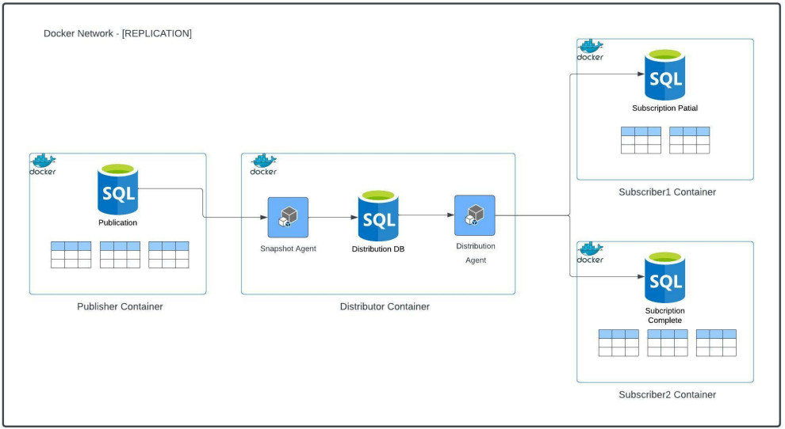

# [BD2] - Practica3_201313722

Bases de datos2 , Replicacion con contenedores

# Descripcion

Actualmente las estrategias de replicación en las bases de datos han tomado un
gran auge con la expansión del entorno cloud. Podemos contar con grandes clusters
de base de datos repartidos por diferentes regiones para asegurar la alta
disponibilidad y tomando en cuenta cualquier situación de desastre.

Como estudiante de Ingeniería en Sistemas debe conocer las diferentes estrategias
de replicación que puede proveer una base de datos y estar en capacidad en qué
situación conviene utilizar cada una. En la presente practica estará haciendo una
demostración sobre el conocimiento de las diferentes réplicas que ofrece SQL
server y cómo podemos llevarlo a un entorno de contenedores.


# Arquitectura


# Comandos

* Creacion de contenedores

``` 
docker run -h publisher --name publisher -e 'ACCEPT_EULA=Y' -e 'SA_PASSWORD=Santi1' -p 1451:1433 -d mcr.microsoft.com/mssql/server:2019-CU15-ubuntu-20.04
docker run -h subscriber1 --name subscriber1 -e 'ACCEPT_EULA=Y' -e 'SA_PASSWORD=Santi1' -p 1452:1433 -d mcr.microsoft.com/mssql/server:2019-CU15-ubuntu-20.04
docker run -h subscriber2 --name subscriber2 -e 'ACCEPT_EULA=Y' -e 'SA_PASSWORD=Santi1' -p 1453:1433 -d mcr.microsoft.com/mssql/server:2019-CU15-ubuntu-20.04
docker run -h distributor --name distributor -e 'ACCEPT_EULA=Y' -e 'SA_PASSWORD=Santi1' -p 1454:1433 -d mcr.microsoft.com/mssql/server:2019-CU15-ubuntu-20.04
```

* Activacion de agentes

``` 
docker exec -it -u 0 distributor /opt/mssql/bin/mssql-conf set sqlagent.enabled true
docker exec -it -u 0 publisher  /opt/mssql/bin/mssql-conf set sqlagent.enabled true 
docker exec -it -u 0 subscriber1  /opt/mssql/bin/mssql-conf set sqlagent.enabled true 
docker exec -it -u 0 subscriber2  /opt/mssql/bin/mssql-conf set sqlagent.enabled true 
```
* Creacion de red de contenedores

```
docker network create REPLICATION
docker network connect REPLICATION publisher
docker network connect REPLICATION distributor
docker network connect REPLICATION subscriber1
docker network connect REPLICATION subscriber2
```

* Configuracion de carpeta distribuidor
```
docker exec -it distributor /bin/bash
cd var/opt/mssql 
mkdir ReplData
```

   
